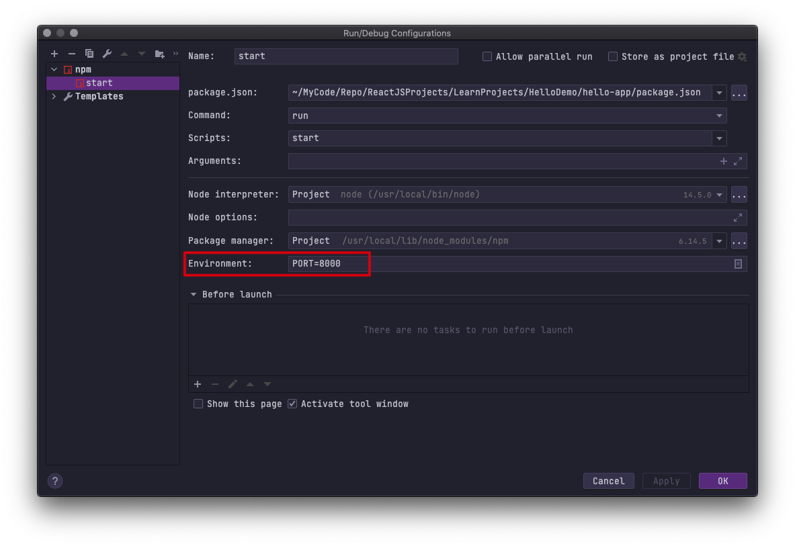

## 使用方式

1. 直接 CDN 引入使用 react，不编译
   1. 不能使用 JSX，必须使用 react API

2. 直接 CDN 引入 react 和 babel，不编译
   1. 可以使用 JSX，必须使用 react API

3. 使用编译
   1. 安装脚手架工具 `npm install -g create-react-app`
   2. 创建脚手架 `create-react-app my-app`
   3. 运行 `npm run start`

webstorm 中运行 node http-server 修改端口


## 记忆点

### 事件回调函数的使用方式

因为 JavaScript class 的方法默认不会绑定 this，所以不能直接在回调函数中使用 this

有 3 种方式:

    1. 构造函数中绑定 this
    2. 使用 class field
    3. 使用箭头函数
        每次渲染多会创建不同的回调函数，可能造成重复渲染

### function 组件和 class 组件的区别

    - class 组件可以使用 state 和 声明周期，function 不能。
    - class 组件可以使用 ref，function 不能，function 只能使用 forwardRef，function 组件可以在内部使用 ref
    - function 可以使用 hook，class 不能使用
    - function 组件没有实例，class 组件有实例

### Props & State

    区别
    - Props 是用于组件间数据传递，state 用于存储自身数据
    - Props function 和 class 中都可使用，state 只能在 class 中；从 v16.8.0后，function 组件中可以使用 state hook
    - Props 是只读的，state 可以修改；Props 是单向数据流动，state 是可以双向流动，

### Fragments

用于一个组件返回多个组件。

#### 用法

```js
class Columns extends React.Component {
  render() {
    return (
      <React.Fragment>
        <td>Hello</td>
        <td>World</td>
      </React.Fragment>
    );
  }
}
```

#### 短语法

```js
class Columns extends React.Component {
    render() {
        return (
        <>
            <td>Hello</td>
            <td>World</td>
        </>
        );
    }
}
```

短语法不能使用 Key 或属性，长语法可以使用 Key

### 跨层级组件交互方式

- props 传递
- context 传递
- ref
- ref 转发


### 逻辑代码复用

- hook
- render Props，告知组件需要渲染什么内容的函数 prop，[render props](https://react.docschina.org/docs/render-props.html)

## clsx 的使用

[clsx](https://www.npmjs.com/package/clsx) 用于方便的合并 css class。否则需要自己拼接等处理。

