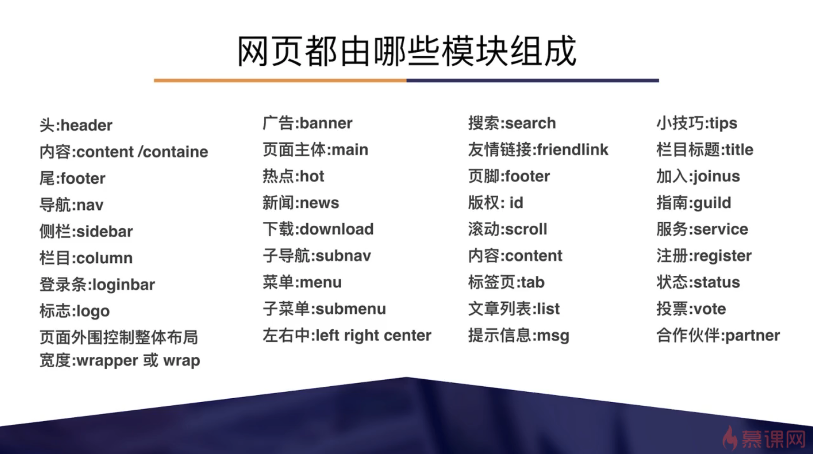

## 后端开发学习 WebUI 的出发点

后端开发学习前端开发，首先需要学习简单可用的 WebUI 开发。

可用的 WebUI 包括内容和样式。

内容需要学习的技术有 HTML & JS。
样式需要学习的技术 CSS。
但仅知道 HTML & JS & CSS 这些轮子还不够，还需要从整体了解 WebUI 的设计。

可学习的资源有：

- [设计网站外观](https://developer.mozilla.org/zh-CN/docs/Learn/Getting_started_with_the_web/What_will_your_website_look_like)
- [Web UI设计理论入门(慕课网)](https://www.imooc.com/learn/794)
- [Steps to Improve Your Website Design](https://www.taniarascia.com/design-for-developers/)
- [Photon 设计原则](https://design.firefox.com/photon/introduction/principles.html)

Web UI设计理论入门(慕课网)

## 屏幕分辨率

屏幕上显示的像素的个数，同尺寸，分辨率越高，效果越细腻。
显示器常见比例和分辨率
5：4，800 x 640, 1280 x 1024
4：3，800 x 600, 1280 x 960, 1024 x 768, 1400 x 1050, 1600 x 1200, 2048 x 1536
16：10，1280 x 800, 1440 x 900, 1680 x 1050, 1920 x 1200
16：9, 1280 x 720, 1440 x 810, 1680 x 945, 1920 x 1080

web 宽度设计可以设计成常见的 1024 或者 自适应布局，以获得最佳的阅读体验。

## web 分类

## 网页构成

## 网页实现

HTML 结构
CSS 样式
JavaScript 行为

### HTML 色彩

16 进制，#16abcd

### web 标准化布局原理

- 把网页看成多个网格
- 先有行再有列（从上到下）
- 先做容器在做内容（从外到内）

## 设计维度

- 版式
- 色彩
- 图片
- 字体
- 段落
- 细节

## 界面设计流程

- 版式
- 制作
- 输出

需求-策划-原型图-设计图-制作-发布

分析需求-制作草图-优化版式-填充内容-样式设计-优化-切图-输出

## 基本规范

设计规范

色彩规范
字体规范
图标规范
按钮规范
...

## 字体选择

衬线字体（强调笔画开始和结束），典型的如，宋体，但是远处的话，就不易识别
无衬线字体（宽度一致）

### 字体的属性

- 字号，单位有磅，点，像素等
- 粗细，粗体，细体，常规体，斜体等
- 字体颜色，各种颜色，常见：正文黑色和超链接

### 浏览器使用字体的机制

根据字体样式从系统从查找，查找不到使用系统默认字体。

解决办法

1. 使用通用字体
2. 使用在线字体，英文字体体积较小，但中文字体体积较大，

## 色彩的运用

和谐、均衡和重点突出的原则，将不同的色彩组合。根据色彩对人心理的影响，合理运用。
对比度大的更清晰。

### 色彩基础知识

色彩三要素：色相、明度、纯度
对比色
互补色
同类色

色轮，相对的是对比度最大的。

### 案例

1. 科技企业，白蓝板块相间
2. 儿童网站，绿色，卡通
3. 荔枝水果，荔枝色

### 典型色

蓝色：沉稳，理智，科技感，数字
绿色：安全
红色、黄色：奔放

## web 尺寸单位

常用尺寸：
px 像素，显示器上的最小单位，不是物理单位，受屏幕像素数影响。
pt 磅、点，长度单位，物理尺寸，1pt = 1/72 英寸
PPI(DPI) 每英寸的像素数，是一个率，用来表示精度
em 百分比(%)

## web 中的图像格式

gif
jpeg
png-8
png-24
wbmp

JPG: 适应性强，通用性强
GIF: 动态、静态，可以透明底，体积小，表情常用
PNG：提交小，透明底，开发常用，用来替代 GIF 和 TIFF

视频格式

FLV

音频格式

MP3

## 视觉层次

点线面塑造的空间效果。
比如，
- 透视原理（近大远小）。
- 景深（近实远虚）。

## 元素层次

## 色彩层次

亮的在前，暗的在后

## 切图的作用

给前端开发提供素材
图片保存 PNG

## 官网首页设计

功能

- 展示企业形象
- 传播主要业务
- 集合功能入口

